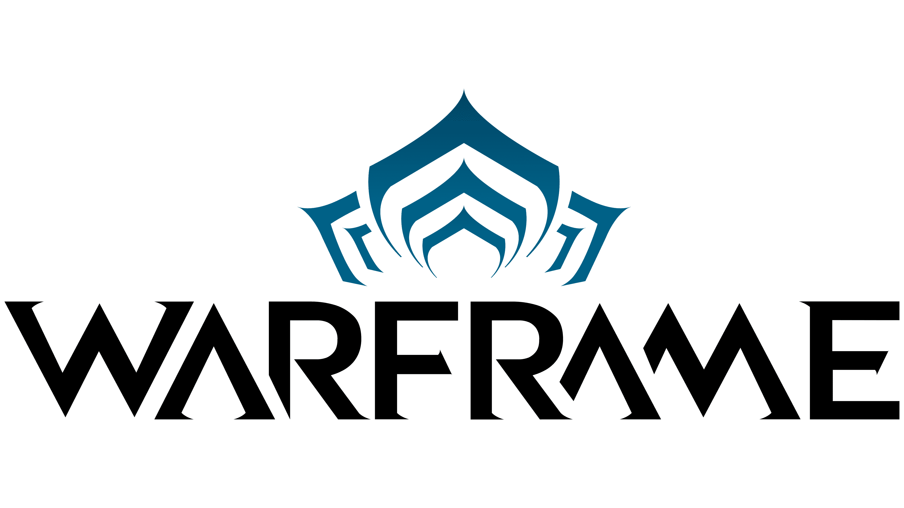

# Kingdom of Inmortals (Warframe)

Kingdom of Inmortals fue Creado el 2015. Creemos y seguimos sosteniendo que la comunidad la hacen los usuarios y que el contenido debe estar por arriba de este. Aceptamos con mucho esfuerzo hacer que tanto gente nueva en discord como hasta los más experimentados puedan tener una estadía agradable y puedan adaptarse.