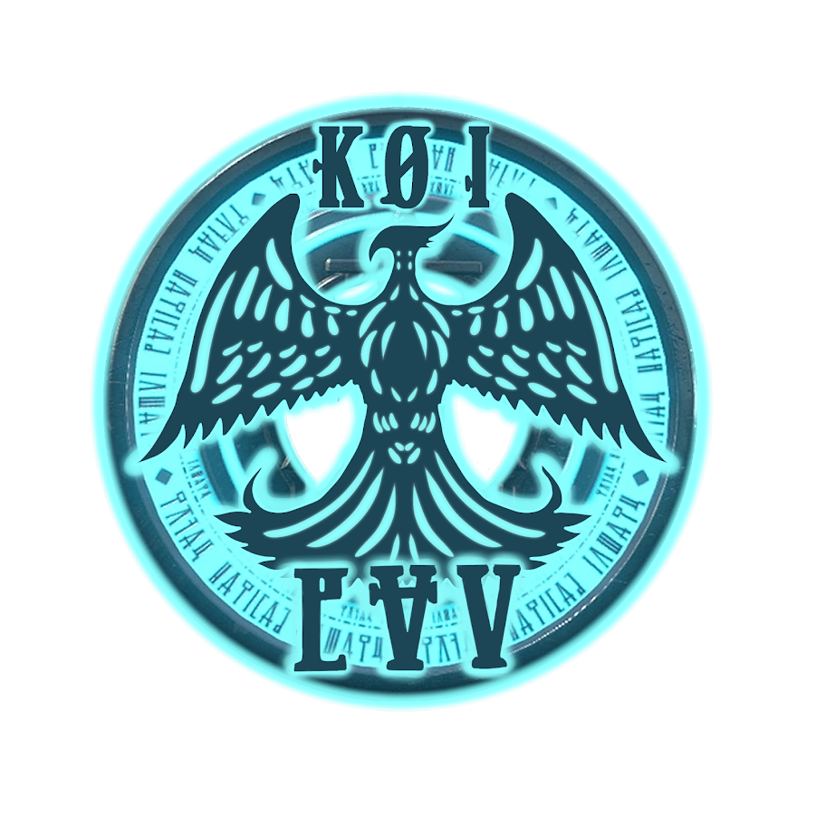

[maven-central]: https://img.shields.io/maven-central/v/net.dv8tion/JDA?color=blue
[jitpack]: https://img.shields.io/badge/Snapshots-JitPack-blue
[installation]: #-installation
[discord-invite]: https://discord.gg/0hMr4ce0tIl3SLv5
[migration]: https://jda.wiki/introduction/migration-v4-v5/
[jenkins]: https://ci.dv8tion.net/job/JDA5
[license]: https://github.com/discord-jda/JDA/tree/master/LICENSE
[faq]: https://jda.wiki/introduction/faq/
[docs]: https://docs.jda.wiki/index.html
[wiki]: https://jda.wiki/introduction/jda/
[troubleshooting]: https://jda.wiki/using-jda/troubleshooting/
[discord-shield]: https://discord.com/api/guilds/125227483518861312/widget.png
[faq-shield]: https://img.shields.io/badge/Wiki-FAQ-blue.svg
[docs-shield]: https://img.shields.io/badge/Wiki-Docs-blue.svg
[troubleshooting-shield]: https://img.shields.io/badge/Wiki-Troubleshooting-darkgreen.svg
[jenkins-shield]: https://img.shields.io/badge/Download-Jenkins-purple.svg
[license-shield]: https://img.shields.io/badge/License-Apache%202.0-white.svg
[migration-shield]: https://img.shields.io/badge/Wiki-Migrating%20from%20V4-darkgreen.svg
[GatewayIntent]: https://docs.jda.wiki/net/dv8tion/jda/api/requests/GatewayIntent.html
[JDABuilder]: https://docs.jda.wiki/net/dv8tion/jda/api/JDABuilder.html
[DefaultShardManagerBuilder]: https://docs.jda.wiki/net/dv8tion/jda/api/sharding/DefaultShardManagerBuilder.html

# JDA (Java Discord API)

Kingdom of Inmortals fue Creado el 2015. Creemos y seguimos sosteniendo que la comunidad la hacen los usuarios y que el contenido debe estar por arriba de este. Aceptamos con mucho esfuerzo hacer que tanto gente nueva en discord como hasta los más experimentados puedan tener una estadía agradable y puedan adaptarse.